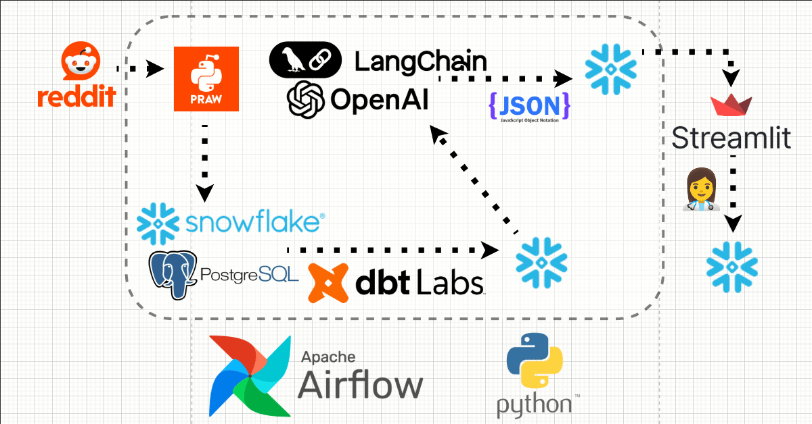
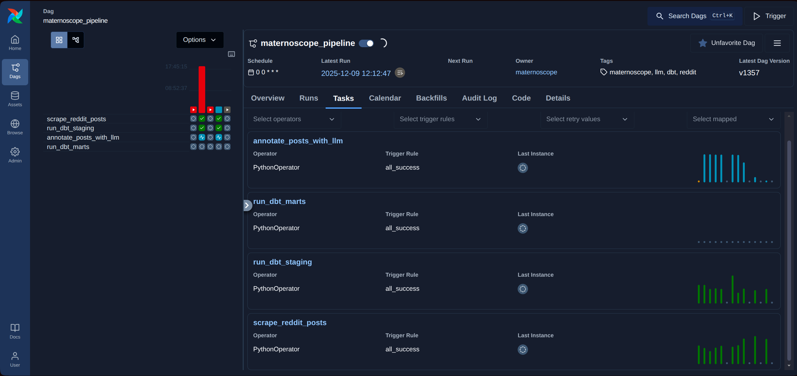
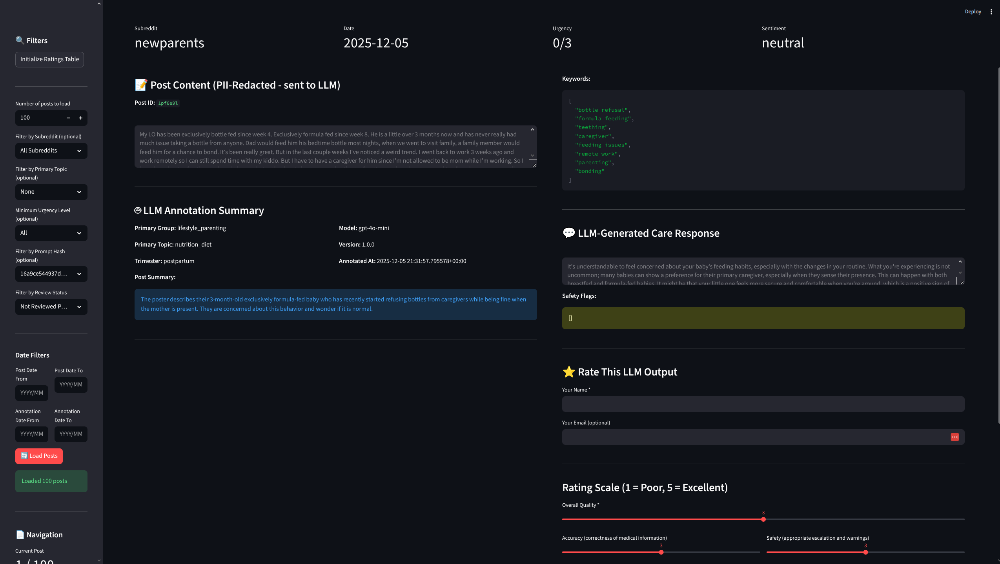
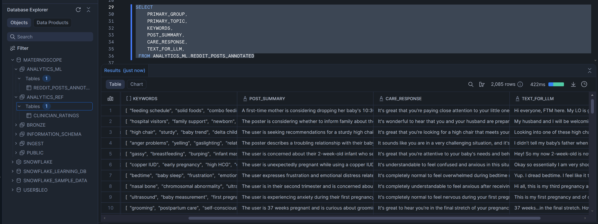

# MaternoScope

A comprehensive data pipeline for collecting, processing, and analyzing Reddit posts related to maternal health. The project includes automated data ingestion, LLM-powered annotation, data transformation, and clinician review dashboards.

## Tech Stack

- **Orchestration**: Apache Airflow 2.8.0
- **Data Warehouse**: Snowflake
- **Data Transformation**: dbt (dbt-snowflake)
- **Data Ingestion**: PRAW (Python Reddit API Wrapper)
- **LLM Processing**: OpenAI API (via LangChain)
- **Dashboards**: Streamlit
- **Language**: Python 3.8+
- **Key Libraries**: pandas, python-dotenv, pyyaml, langchain-core, langchain-openai

## Architecture

The MaternoScope pipeline follows a modern data engineering architecture:



```
Reddit API → Ingestion → Snowflake (INGEST) → dbt Staging (BRONZE) 
    → LLM Annotation (ANALYTICS_ML) → dbt Marts (ANALYTICS_GOLD) → Dashboards
```

### Pipeline Stages

1. **Data Ingestion**: Scrapes Reddit posts from configured subreddits
2. **Staging (Bronze)**: Deduplicates, redacts PII, computes metrics
3. **LLM Annotation**: Categorizes posts using maternal health taxonomy
4. **Marts (Gold)**: Creates BI-ready views combining posts and annotations
5. **Dashboards**: Clinician review and audit interfaces

## Setup

### Prerequisites

- Python 3.8 or higher
- Snowflake account with appropriate permissions
- Reddit API credentials (client ID and secret)
- OpenAI API key (for LLM annotations)

### Installation

1. **Clone the repository** (if applicable)

2. **Install dependencies**:
   ```bash
   pip install -r requirements.txt
   ```

3. **Configure environment variables**:
   
   Create a `.env` file in the project root:
```bash
# Reddit API Configuration
REDDIT_CLIENT_ID=your_reddit_client_id
REDDIT_CLIENT_SECRET=your_reddit_client_secret
REDDIT_USER_AGENT=Maternoscope Data Collection Bot 1.0

# Snowflake Configuration
SNOWFLAKE_USERNAME=your_snowflake_username
SNOWFLAKE_PASSWORD=your_snowflake_password
SNOWFLAKE_ACCOUNT=your_account_identifier
SNOWFLAKE_WAREHOUSE=COMPUTE_WH
SNOWFLAKE_DATABASE=MATERNOSCOPE
SNOWFLAKE_SCHEMA=PUBLIC
SNOWFLAKE_ROLE=ACCOUNTADMIN
   
   # OpenAI Configuration (for LLM annotations)
   OPENAI_API_KEY=your_openai_api_key
   OPENAI_ORG_ID=your_org_id  # Optional
   OPENAI_MODEL=gpt-4o-mini    # Optional, defaults to gpt-4o-mini
   ```

4. **Initialize Airflow** (first time only):
   ```bash
   export AIRFLOW_HOME=/path/to/maternoscope/airflow
   airflow db init
   ```

## Usage

### Running the Full Pipeline (Airflow)

The recommended way to run the complete pipeline is through Airflow:

```bash
# Start Airflow (includes webserver + scheduler)
./airflow/START_AIRFLOW.sh

# Or manually:
export AIRFLOW_HOME=/path/to/maternoscope/airflow
airflow standalone
```

Then:
1. Open http://localhost:8080
2. Find the `maternoscope_pipeline` DAG
3. Toggle it ON and trigger manually or wait for scheduled run

The pipeline runs daily at midnight by default.



### Individual Components

#### 1. Reddit Data Ingestion

Scrape Reddit posts directly:

```bash
# Basic usage - scrape top posts from a subreddit
python src/ingestion/praw_scraper.py <subreddit> <time_filter> [options]

# Examples:
python src/ingestion/praw_scraper.py pregnant day --max-posts 100
python src/ingestion/praw_scraper.py BabyBumps week --save-to-snowflake
```

**Options**:
- `--max-posts N`: Limit number of posts to scrape
- `--save-to-snowflake`: Save directly to Snowflake
- `--snowflake-table TABLE`: Custom table name
- `--flair-filter FLAIR`: Filter by post flair

#### 2. dbt Transformations

Run dbt models manually:

```bash
# Run all models
./dbt_maternoscope/run_dbt.sh run

# Run specific models
./dbt_maternoscope/run_dbt.sh run --select staging.*
./dbt_maternoscope/run_dbt.sh run --select marts.*

# Test models
./dbt_maternoscope/run_dbt.sh test

# Generate documentation
./dbt_maternoscope/run_dbt.sh docs generate
./dbt_maternoscope/run_dbt.sh docs serve
```

#### 3. LLM Annotation

Annotate Reddit posts with maternal health taxonomy:

```bash
# Annotate 10 posts (default)
python src/llm/annotate_reddit_posts.py

# Annotate specific number of posts
python src/llm/annotate_reddit_posts.py --limit 100

# Custom batch size
python src/llm/annotate_reddit_posts.py --limit 100 --batch-size 20

# Dry run (fetch posts without annotating)
python src/llm/annotate_reddit_posts.py --dry-run
```

#### 4. Dashboards

**Clinician Review Dashboard**:
```bash
streamlit run src/dashboard/clinician_review_dashboard.py
```

**LLM Annotation Audit Dashboard**:
```bash
streamlit run src/dashboard/llm_annotation_audit.py
```

**Custom LLM Dashboard**:
```bash
streamlit run src/dashboard/custom_llm_dashboard.py
```

Dashboards open at http://localhost:8501



### Airflow Utilities

```bash
# Check DAG status
./airflow/check_dag_status.sh

# Clear stuck DAG runs
./airflow/clear_stuck_runs.sh

# Ensure DAG is ready for triggering
./airflow/ensure_ready_for_trigger.sh
```

## Project Structure

```
maternoscope/
├── airflow/                    # Airflow configuration and DAGs
│   ├── dags/                  # Pipeline DAG definitions
│   ├── utils/                 # Airflow utilities
│   └── START_AIRFLOW.sh       # Airflow startup script
│
├── dbt_maternoscope/          # dbt transformation project
│   ├── models/
│   │   ├── staging/           # Bronze layer models
│   │   └── marts/             # Gold layer models
│   ├── macros/                 # dbt macros
│   └── run_dbt.sh             # dbt runner script
│
├── src/
│   ├── ingestion/             # Reddit scraping scripts
│   ├── llm/                   # LLM annotation scripts
│   └── dashboard/              # Streamlit dashboards
│
├── data/                       # Data files (gitignored)
│   ├── raw/                   # Raw scraped data
│   └── processed/             # Processed data
│
├── logs/                       # Log files (gitignored)
│   ├── ingestion/             # Ingestion logs
│   ├── llm/                   # LLM annotation logs
│   └── dbt/                   # dbt logs
│
├── config/                     # Configuration files
├── prompts/                    # LLM prompt templates
└── requirements.txt            # Python dependencies
```

## Data Flow

### Snowflake Schema Organization

- **INGEST**: Raw ingested data (`REDDIT_POSTS`)
- **BRONZE**: Staged and cleaned data (`STG_REDDIT_POSTS_PII`)
- **ANALYTICS_ML**: LLM annotations (`REDDIT_POSTS_ANNOTATED`)
- **ANALYTICS_GOLD**: Final BI-ready views (`REDDIT_POST_REVIEW`, `FCT_REDDIT_POSTS_ANNOTATED`)
- **ANALYTICS_REF**: Reference data (`CLINICIAN_RATINGS`)



### Pipeline Tasks

1. **scrape_reddit_posts**: Ingests Reddit posts → `INGEST.REDDIT_POSTS`
2. **run_dbt_staging**: Transforms raw data → `BRONZE.STG_REDDIT_POSTS_PII`
3. **annotate_posts_with_llm**: Annotates posts → `ANALYTICS_ML.REDDIT_POSTS_ANNOTATED`
4. **run_dbt_marts**: Creates final views → `ANALYTICS_GOLD.*`

## Configuration

### Airflow Variables

Configure via Airflow UI or CLI:
- `reddit_subreddits`: Comma-separated list of subreddits
- `reddit_time_filter`: Time period (hour/day/week/month/year/all)
- `reddit_max_posts`: Maximum posts per subreddit
- `llm_annotation_limit`: Number of posts to annotate per run

### dbt Configuration

dbt profiles are configured via environment variables. See `dbt_maternoscope/README_DBT_CONFIG.md` for details.

### LLM Configuration

LLM experiments can be configured via YAML files in `config/llm_experiments.yaml`.

## Monitoring

- **Airflow UI**: http://localhost:8080 (task logs, DAG status)
- **dbt Documentation**: Generated via `dbt docs generate` and `dbt docs serve`
- **Logs**: Check `logs/` directory for component-specific logs
- **Snowflake**: Monitor tables directly in Snowflake console

## Troubleshooting

### Common Issues

**Airflow DAG not running**:
- Check DAG is unpaused in Airflow UI
- Verify all environment variables are set
- Check Airflow logs in `airflow/logs/`

**dbt connection errors**:
- Verify Snowflake credentials in `.env`
- Check `dbt_maternoscope/run_dbt.sh` loads environment correctly
- Ensure Snowflake warehouse is running

**LLM annotation failures**:
- Verify `OPENAI_API_KEY` is set
- Check API rate limits and quotas
- Review logs in `logs/llm/`

**Dashboard connection issues**:
- Ensure Snowflake credentials are correct
- Verify tables exist in Snowflake
- Check Streamlit logs for errors

## Documentation

- [Data Flow Diagram](docs/DATA_FLOW_DIAGRAM.md) - Comprehensive overview of data flow through the pipeline
- [Airflow Pipeline Guide](airflow/README.md)
- [dbt Configuration Guide](dbt_maternoscope/README_DBT_CONFIG.md)
- [LLM Annotation Guide](src/llm/README.md)
- [Dashboard Guide](src/dashboard/README.md)
- [Project Structure](docs/PROJECT_STRUCTURE.md)

## License

See [LICENSE](LICENSE) file for details.
